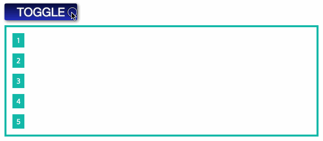

- SCSS is used

[Here is the main code](https://github.com/alexkval/stack-transitions/blob/master/scss/main.scss)

```scss
$clr-cbar: #25b7a8;

.cbars {
  padding: 12px;
  border: solid 4px $clr-cbar;
}

.cbars-bar {
  display: block;
  margin-bottom: 12px;
  padding: 2px 0;
  width: 24px;
  color: #fff;
  background-color: $clr-cbar;
  text-align-last: center;
  transition: width 0.5s;
}
.cbars-bar:last-child {
  margin-bottom: 0;
}

.is-expanded {
  width: 100%;
}

$n: 5;
$delay: 0.1;

@for $i from 1 through $n {
  $in: $delay * ($i - 1);
  $out: $delay * ($n - $i);

  .cbars-bar:nth-child(#{$i}) {
    transition-delay: #{$out}s;
  }
  .cbars-bar.is-expanded:nth-child(#{$i}) {
    transition-delay: #{$in}s;
  }
}
```

The result lools like:

